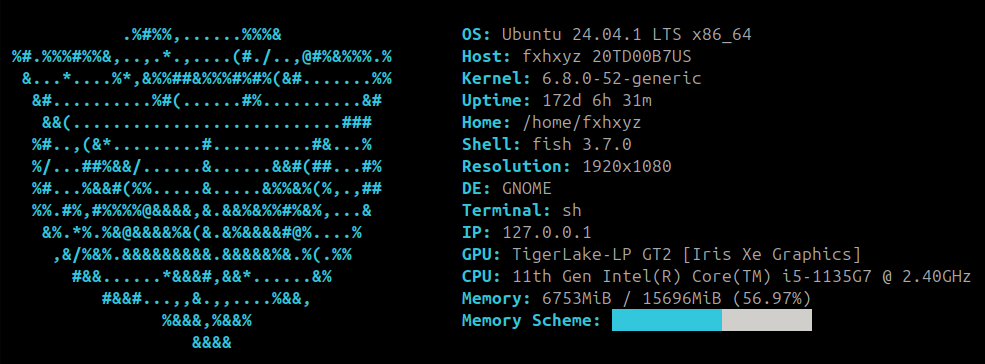

# Neofetch killer




#

### how to build
### install packages
### ```sudo chmod +x ./build.sh```
### ```./build.sh```

#

### Suggestions:
- ### write in [issues](https://github.com/fxhxyz4/nekofetch/issues).
- ### write in [discussions](https://github.com/fxhxyz4/nekofetch/discussions/).

#

### License: [MIT License](./LICENSE.md).
